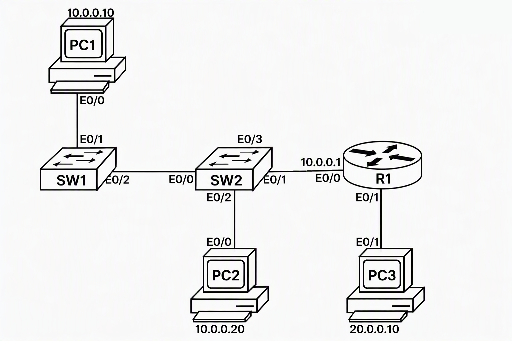

# Cisco Telnet Lab

Basic router configuration on a Cisco router (R1) in a lab: interface IP addressing, line passwords, enable secret, password encryption, and Telnet access, followed by troubleshooting a "Connection refused" error.

## Topology



| Device | Interface | IP Address |
|--------|-----------|------------|
| R1     | E0/0      | 10.0.0.1/24 |
| R1     | E0/1      | 20.0.0.1/24 |
| PC1    | -         | 10.0.0.10  |
| PC2    | -         | 10.0.0.20  |
| PC3    | -         | 20.0.0.10  |

## What I configured

### 1. Check the interfaces

```text
Router(config)# do show ip int brief
Interface                  IP-Address      OK? Method Status                Protocol
Ethernet0/0                unassigned      YES unset  administratively down down
Ethernet0/1                unassigned      YES unset  administratively down down
Ethernet0/2                unassigned      YES unset  administratively down down
Ethernet0/3                unassigned      YES unset  administratively down down
Serial1/0                  unassigned      YES unset  administratively down down
Serial1/1                  unassigned      YES unset  administratively down down
Serial1/2                  unassigned      YES unset  administratively down down
Serial1/3                  unassigned      YES unset  administratively down down
```

All interfaces start as `unassigned` and `administratively down`.

### 2. Assign IP addresses

```text
Router(config)# int e0/0
Router(config-if)# ip add 10.0.0.1 255.255.255.0
Router(config-if)# no shutdown
Router(config-if)# exit
*Oct  3 06:38:16.474: %LINK-3-UPDOWN: Interface Ethernet0/0, changed state to up
*Oct  3 06:38:17.479: %LINEPROTO-5-UPDOWN: Line protocol on Interface Ethernet0/0, changed state to up

Router(config)# int e 0/1
Router(config-if)# ip add 20.0.0.1 255.255.255.0
Router(config-if)# no shutdown
Router(config-if)# exit
*Oct  3 06:38:51.727: %LINK-3-UPDOWN: Interface Ethernet0/1, changed state to up
*Oct  3 06:38:52.729: %LINEPROTO-5-UPDOWN: Line protocol on Interface Ethernet0/1, changed state to up
```

Result:

```text
Router(config)# do sh ip int brief
Interface                  IP-Address      OK? Method Status                Protocol
Ethernet0/0                10.0.0.1        YES manual up                    up
Ethernet0/1                20.0.0.1        YES manual up                    up
Ethernet0/2                unassigned      YES unset  administratively down down
Ethernet0/3                unassigned      YES unset  administratively down down
Serial1/0                  unassigned      YES unset  administratively down down
Serial1/1                  unassigned      YES unset  administratively down down
Serial1/2                  unassigned      YES unset  administratively down down
Serial1/3                  unassigned      YES unset  administratively down down
```

### 3. Set line passwords

```text
Router(config)# line con 0
Router(config-line)# password cisco
Router(config-line)# login
Router(config-line)# exit

Router(config)# line aux 0
Router(config-line)# password disco
Router(config-line)# login
Router(config-line)# exit

Router(config)# line vty 0 4
Router(config-line)# password kisko
Router(config-line)# login
Router(config-line)# exit
```

### 4. Set the enable secret

```text
Router(config)# enable secret sunny
```

Verify with `show running-config` (output trimmed; secret hash redacted):

```text
Router# show running-config
Building configuration...

hostname Router
!
enable secret 5 $1$xxxx$xxxxxxxxxxxxxxxxxxxxxx
!
interface Ethernet0/0
 ip address 10.0.0.1 255.255.255.0
!
interface Ethernet0/1
 ip address 20.0.0.1 255.255.255.0
!
interface Ethernet0/2
 no ip address
 shutdown
!
interface Ethernet0/3
 no ip address
 shutdown
!
line con 0
 password cisco
 login
line aux 0
 password disco
 login
line vty 0 4
 password kisko
 login
!
end
```

At this point the line passwords are still visible in plain text. Only the enable secret is hashed.

### 5. Change the hostname

```text
Router# config t
Router(config)# hostname R1
R1(config)#
```

### 6. Encrypt plain-text passwords

```text
R1(config)# service password-encryption
```

Verify with `show running-config` (output trimmed; secret hash redacted):

```text
R1# show running-config
Building configuration...

service password-encryption
!
hostname R1
!
enable secret 5 $1$xxxx$xxxxxxxxxxxxxxxxxxxxxx
!
interface Ethernet0/0
 ip address 10.0.0.1 255.255.255.0
!
interface Ethernet0/1
 ip address 20.0.0.1 255.255.255.0
!
interface Ethernet0/2
 no ip address
 shutdown
!
interface Ethernet0/3
 no ip address
 shutdown
!
line con 0
 password 7 05080F1C2243
 login
line aux 0
 password 7 070B285F4D06
 login
line vty 0 4
 password 7 030F52180D00
 login
 transport input all
!
end
```

Now the line passwords show as `password 7 ...` instead of plain text. Type 7 is only weak obfuscation and can be reversed easily, while `enable secret` uses a stronger hash.

## Troubleshooting: Telnet "Connection refused"

After setting the VTY password and `login`, Telnet to the router failed:

```text
R1(config)# do telnet 10.0.0.1
Trying 10.0.0.1 ... 
% Connection refused by remote host
```

The same error appeared for `20.0.0.1`. The fix was to explicitly allow Telnet on the VTY lines:

```text
R1(config)# line vty 0 4
R1(config-line)# password kisko
R1(config-line)# login
R1(config-line)# transport input all
R1(config-line)# exit
```

After that the connection opened:

```text
R1(config)# do telnet 10.0.0.1
Trying 10.0.0.1 ... Open

User Access Verification

Password:
R1>
```

Trying `en` at this point asked for the enable password. With the wrong password entered three times, the router answered `% Bad secrets` and stayed in User EXEC mode, which shows `enable secret` is protecting privileged mode.

## Mistakes I made and what I learned

| What I typed | Problem | Correct |
|--------------|---------|---------|
| `do show int brief` | Invalid input | `do show ip int brief` |
| `hostname R1` at `Router#` | Invalid input, hostname is a global config command | `config t` first, then `hostname R1` |
| Telnet right after setting VTY password | Connection refused | Add `transport input all` (or `telnet`) on the VTY lines |

## Files
- [`R1-config.txt`](R1-config.txt): the final configuration as commands
- [`session-log.txt`](session-log.txt): terminal session from the lab
- [`telnet.png`](telnet.png): topology diagram

## Notes

- Telnet sends data, including passwords, in plain text. This is for learning only; real networks should use SSH.
- The passwords here are lab-only examples.
